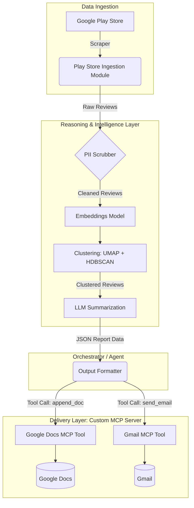

# Weekly Product Review Pulse — System Architecture

This document outlines the architecture for the Weekly Product Review Pulse system, specifically tailored for the Groww app using Google Play Store data and delivered via a custom Google Workspace MCP server.

## 1. High-Level Architecture

The system is composed of three primary blocks:
1. **Data Ingestion & Processing Pipeline (The Agent/Orchestrator)**
2. **Reasoning & Intelligence Layer (Embeddings, Clustering, LLMs)**
3. **Delivery Layer (Custom Google Workspace MCP Server)**

## 2. Component Details

### 2.1. Ingestion Module (Google Play Store)
- **Responsibility:** Fetch user reviews for the Groww app from the Google Play Store.
- **Mechanism:** Uses a scraper-based approach (e.g., `google-play-scraper` in Node.js or `google-play-scraper` in Python).
- **Configuration:** Filters reviews for the last 8–12 weeks based on a configurable time window.

### 2.2. Reasoning Layer
- **PII Scrubbing:** A lightweight step (e.g., regex or NER model) to remove sensitive user information from the raw review text before it hits external LLMs.
- **Embedding & Clustering:**
  - Converts text reviews into dense vector embeddings.
  - Applies dimensionality reduction (UMAP) and density-based clustering (HDBSCAN) to group semantically similar reviews into overarching themes.
- **LLM Summarization:**
  - Takes clustered reviews as context.
  - Names the themes, extracts *verbatim* quotes (validated against the original text), and generates actionable product/support ideas.

### 2.3. Output Formatter
- Translates the structured JSON output from the LLM into the required representations.
- Prepares the payload for the Google Docs API (plain text) and Gmail API (HTML/text).

### 2.4. Custom Google Workspace MCP Server
- **Responsibility:** Act as the secure, isolated bridge between the agent and Google Workspace APIs.
- **Design:** Implements the Model Context Protocol (MCP). The server is deployed on Railway (`https://web-production-5f6ae0.up.railway.app/sse`). The agent connects to this remote server via Server-Sent Events (SSE) to perform actions.
- **Security:** Holds all Google OAuth credentials securely in its own configuration. The main agent codebase does not embed or manage these secrets.
- **Exposed Tools:**
  - `append_to_doc(document_id, content)`: Appends the weekly report as a new dated section to the master pulse document.
  - `send_email(to, subject, body_html)`: Sends the teaser email with a link to the document section.

## 3. Execution & Idempotency

### 3.1. Cadence
The system is designed to run periodically (e.g., every Monday morning) via a scheduled cron job or CI/CD pipeline (like GitHub Actions). It also supports manual CLI invocation for backfilling a specific ISO week.

### 3.2. Idempotency Mechanisms
To prevent duplicate data upon re-running the same week:
- **Google Docs:** The system looks for a stable section anchor (e.g., `# Week 42, 2024 - Groww Review Pulse`) before appending. If found, it either skips or overwrites the section.
- **Gmail:** A run-scoped idempotency key (derived from `product_name + iso_week_number`) is logged or checked to prevent duplicate emails from being sent to stakeholders.

## 4. Technology Stack Recommendations

| Component | Recommended Technology |
| :--- | :--- |
| **Language** | Python or Node.js (depending on team preference) |
| **Scraping** | `google-play-scraper` |
| **Embeddings** | OpenAI `text-embedding-3-small`, Cohere, or local HuggingFace models |
| **Clustering** | `umap-learn` + `hdbscan` (Python ecosystem excels here) |
| **LLM** | Groq API (e.g., Llama 3 models) |
| **MCP Server** | Python MCP SDK or TypeScript MCP SDK |
| **Google APIs** | Google Docs API, Gmail API |
